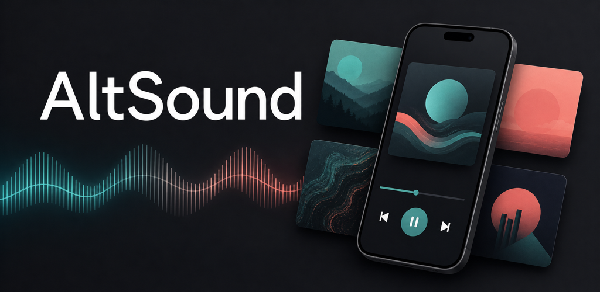

# AltSound

A modern, open-source music player for your [Jellyfin](https://jellyfin.org/) library.

  

Bring your music collection back into a focused listening app. AltSound connects to your Jellyfin server and turns it into a streaming experience for songs **you own** — no subscriptions, no ads, no algorithms tracking what you play.

> AltSound is an unofficial, third-party client. It is not affiliated with or endorsed by the Jellyfin project.

## Install

  

iOS and macOS builds are in development.

## What you need

- A [Jellyfin server](https://jellyfin.org/docs/general/installation/) with a music library.
- The server's URL and your Jellyfin credentials.

That's it. Your credentials stay in the device's secure storage, and the app only talks to your own server.

## Features

- Stream your full Jellyfin music library
- Browse albums, artists, playlists, and liked songs
- Home screen with recently added, most played, and personalized "for you" picks
- Full-text search across songs, albums, and artists
- Full-screen now playing with queue management and synced lyrics
- Instant Mix — turn any song into an endless radio
- Offline downloads with per-track management and cache control
- Remote control of other Jellyfin player sessions
- SyncPlay for synchronized listening across devices
- Playlist backup and restore

## Get the most out of AltSound

AltSound looks great on a plain Jellyfin install, but two server-side plugins unlock the smart features:

- **[Playback Reporting](https://github.com/jellyfin/jellyfin-plugin-playbackreporting)** — official Jellyfin plugin. Required for the home screen's *"most played this week"*, *"recently played"*, and the personalized *"for you"* section. Without it, those sections stay empty.
- **[AudioMuse-AI](https://github.com/NeptuneHub/AudioMuse-AI)** — community plugin that analyzes your library's audio and improves *Instant Mix*, *similar albums*, and *more like this* recommendations. Jellyfin's built-in recommendations work without it, but AudioMuse-AI makes them noticeably better, especially for niche libraries.

Both install through your Jellyfin server's Dashboard → Plugins.

## Privacy

- Your Jellyfin credentials are stored in the device's secure keychain — never in plain text.
- Only the access token is sent to your own server. No data goes to AltSound, the developers, or any third party.
- No analytics. No telemetry. No ads.

## Contributing

AltSound is open source under [Apache License 2.0](LICENSE). Pull requests are welcome — see [CONTRIBUTING.md](.github/CONTRIBUTING.md) to get a development environment running. All contributors are expected to follow the [Code of Conduct](.github/CODE_OF_CONDUCT.md).

## License

Licensed under the [Apache License, Version 2.0](LICENSE). See [NOTICE](NOTICE) for attribution.
